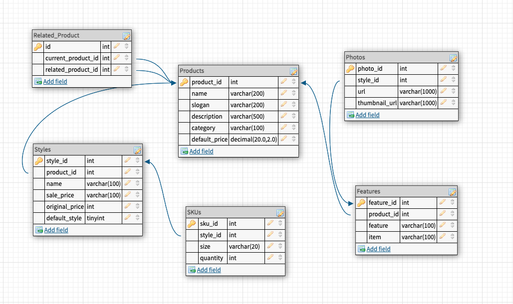
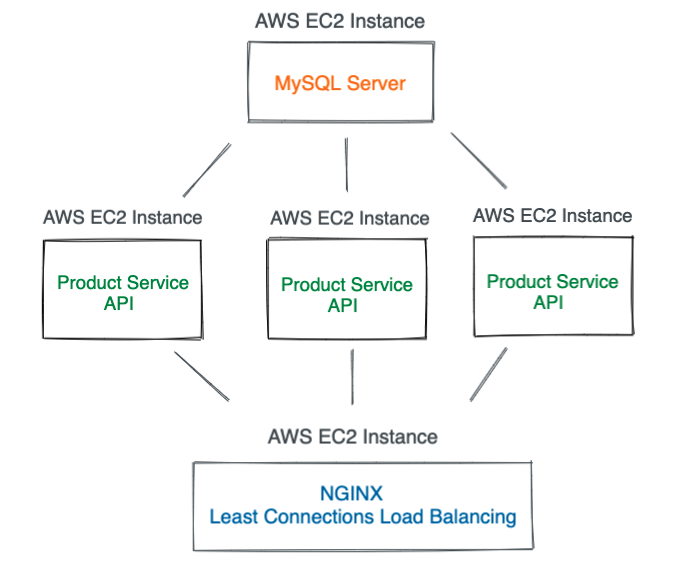
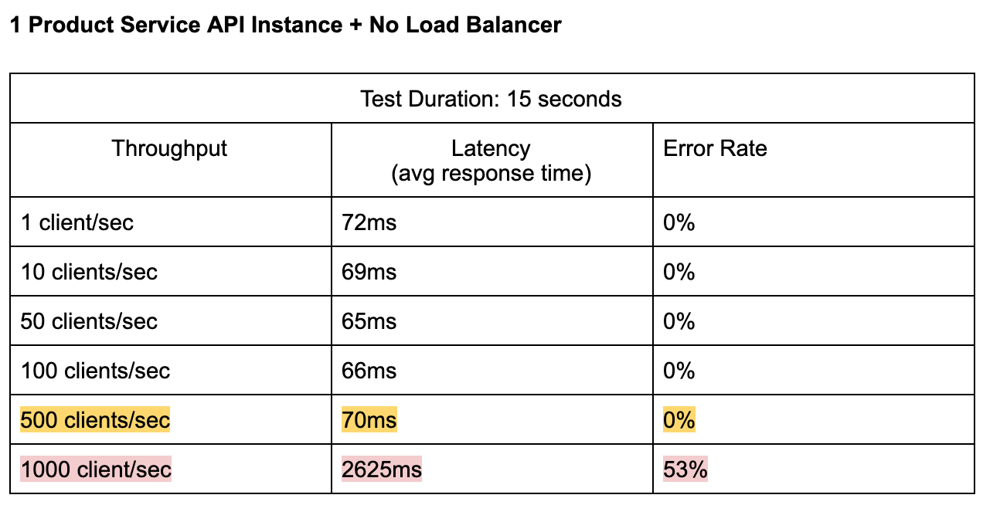
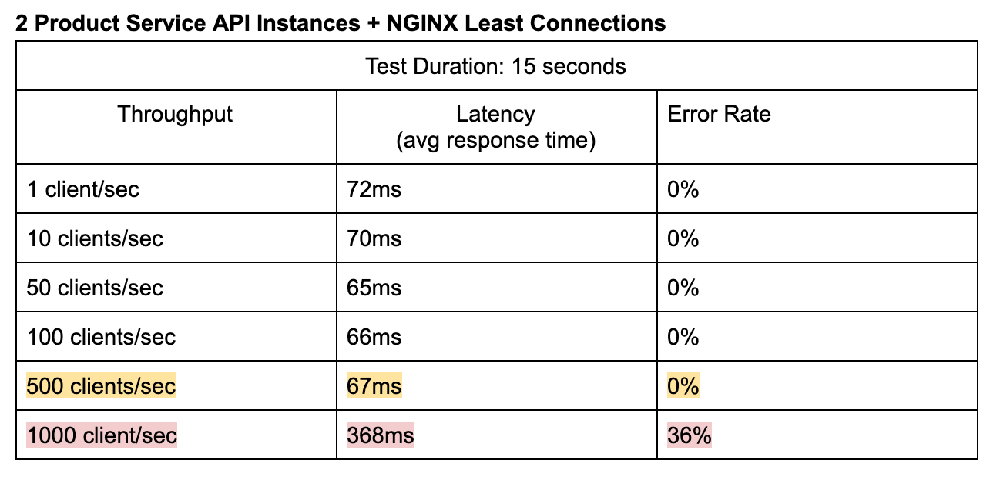
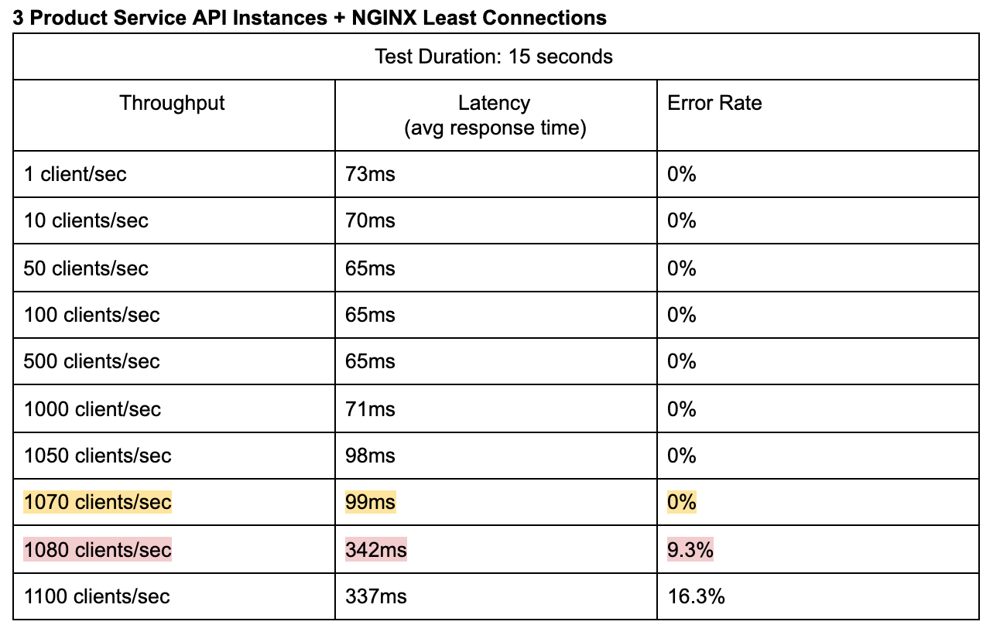

## Products Service API

### Overview
- Rebuilt the backend of an e-commerce website to accommodate production level traffic
- ETL CSV files that contain over 5 million records of products data
- Created multiple Products API routes that allows the client to get all products, get all styles for one product, and get all related products for one product
- Utilized composite indexes to reduce MySQL query response time from 80ms to 10ms
- Optimized throughput by horizontal scaling on AWS and implementing NGINX Least Connections load balancing

### MySQL Database Schema

### Microservice Architecture
- 3 Products Service API Servers
- 1 MySQL Database Server
- 1 NGINX Server

### Optimization Steps
#### No Load Balancing

#### 2 Products Service API Instances + NGINX Least Connections Load Balancing

#### 3 Products Service API Instances + NGINX Least Connections Load Balancing

